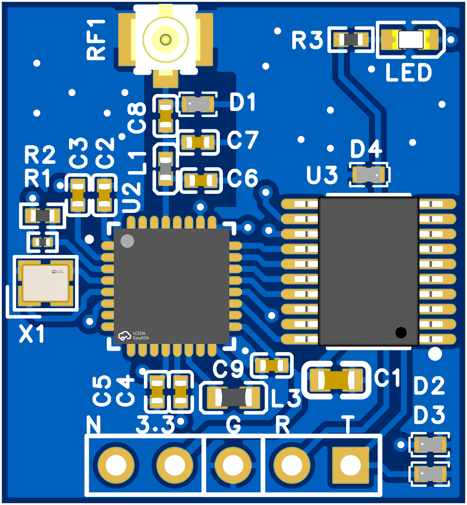

# ADS-B Aircraft Receiver · Product Introduction



---

## One-liner

Power it up, attach an antenna, and your computer sees the aircraft around you in real time — callsign, position, altitude, speed and heading, all from signals the aircraft broadcasts itself. **No internet, no subscription, no monthly fee.**

---

## What it is

A palm-sized ADS-B receiver board. Airliners continuously broadcast their identity and position (ADS-B broadcast). This board receives and decodes those public signals and delivers the live information of every aircraft it hears over a standard serial port to your laptop, Raspberry Pi, microcontroller or drone ground station.

It is a **receive-only** device: it listens, it never transmits, it interferes with nothing. Passive listening to public broadcasts — safe and compliant.

---

## What you will see

Decoded aircraft information, delivered straight out of the serial port:

- **Callsign / registration** — e.g. `CES1234`, `B-652Q`, so you know exactly which flight it is
- **Latitude & longitude** — plotted live on the map
- **Pressure altitude** — how high it is right now
- **Ground speed** — how fast it is covering the ground
- **Heading** — which direction it is flying
- **Climb / descent rate** — climbing or descending
- **Signal strength** — tells you if your antenna is well placed
- **Multi-aircraft tracking** — many aircraft at once, stale targets cleared automatically

---

## Key features

- **No internet, no subscription** — the signal comes from the aircraft itself; no network, no third-party server, works offline, zero running costs
- **Two mainstream output formats** — one for drone ground stations (Mission Planner and the MAVLink ecosystem), one for open-source flight-map tools; switch with a single command
- **Tunable sensitivity** — boost it to reach farther when far from the airport or on a small antenna; dial it back near the airport to cut noise. Takes effect in seconds
- **Self-tuning on power-up** — adapts automatically to different antennas and RF modules; ready out of the box, no test equipment needed
- **Settings survive power-off** — your tuning is stored and restored on every reboot; one command returns to factory defaults
- **Firmware update over one cable** — update through the same serial port; features keep improving and your saved settings are preserved
- **Plug and play** — four wires to a USB-to-serial adapter; powered at 3.3V, so Raspberry Pi / Arduino / microcontrollers connect directly
- **Tiny and low power** — about 10 mA while working; run it from a power bank, car or drone battery; ideal for rooftop, balcony, backpack and field deployment
- **Open-source friendly** — output compatible with mainstream flight-tracking tools, so your own map, logger or dashboard is easy to build

---

## Getting started (4 steps)

1. **Wire it up** — connect the four pins to a USB-to-serial adapter: `3.3V → VCC`, `GND → GND`, `TX → RX`, `RX → TX`, then plug it into your computer. **Use 3.3V — do not connect 5V.**
2. **Fit the antenna** — attach the antenna and place it as high and open as you can (window, balcony, roof), away from metal surfaces and large glass panels
3. **Open the software** — launch your ground station (Mission Planner, for example) or a flight-map tool and select the serial port
4. **Watch the aircraft** — aircraft icons appear on the map; click one for callsign, altitude, speed and heading

Tuning tip: factory settings work out of the box. If you see few aircraft, raise sensitivity by one step, run five minutes, then fine-tune.

---

## Everyday commands

Send from any serial tool (`115200`, 8N1, enable "send newline"). Case-insensitive, terminated by Enter, replies `OK` on success.

- `AT` — test the connection
- `AT&V` — show all current settings
- `AT+PROTOCOL_OUT=MAVLINK2` / `AT+PROTOCOL_OUT=RAW` — switch output format (ground station = the former, flight-map tools = the latter)
- `AT+BAUD=115200` / `AT+BAUD=9600` — change serial baud rate (long cables, legacy hardware)
- `AT+RST` — reboot
- `AT+RSTS` — restore factory settings
- `AT+IAP` — enter firmware-update mode (with the update tool, one cable does the flashing)

Sensitivity (the setting that decides how far you hear):

- Lower value = more sensitive: catches weaker, more distant aircraft, with more noise
- Higher value = cleaner: keeps only strong signals, ideal near an airport
- The factory value is the balanced default and rarely needs changing

---

## Web serial terminal

`Web-serial-at.html` in this repository is a browser serial terminal with this module's AT commands built in as one-click buttons — no driver, no serial-tool setup, no install.

**Wire it to a CH340 / CH341 USB-serial adapter**

- `3.3V → VCC` — the module accepts **3.3V only**. On a CH340 breakout the `VCC` pin is 5V taken straight from USB, so **do not use it**: feed 3.3V from the adapter's 3.3V regulator pin, a debugger, or a separate 3.3V supply
- `GND → GND`
- `TX → RX` and `RX → TX` — cross the pair, this is the single most common reason for "no reply"

**Connect at 115200 and test the link**

1. Open `Web-serial-at.html` in Chrome / Edge / Opera. Web Serial needs a secure context, so serve it and open `http://localhost:8000/Web-serial-at.html` (for example `python -m http.server 8000` in this folder) — a plain `file://` double-click will show a "not a secure context" warning
2. Set **Baud rate 115200**, data bits 8, parity None, stop bits 1, flow control None — the factory default
3. Click **CONNECT** and pick your COM port in the browser prompt; the status bar shows `Connected · 115200 8N1`
4. Click the **AT** quick command — the terminal answers **`OK`**, the link is alive
5. Click **AT&V** to list every parameter, then try **AT+TL_MARGIN=8** (more sensitivity) or **AT+PROTOCOL_OUT=MAVLINK2** (ground-station output)
6. After switching to MAVLink2 the terminal fills with unreadable characters — that is normal, the data is binary. Switch back to `AT+PROTOCOL_OUT=RAW` for readable text, or use the Python viewer below

The quick-command chips (`AT`, `AT&V`, `AT+TL_MARGIN=8`, `AT+GAIN=13`, `AT+PROTOCOL_OUT=MAVLINK2`, `AT+PROTOCOL_OUT=RAW`, `AT+BAUD=115200`, `AT+RST`, `AT+RSTS`) are editable — `+ Add` adds your own, `×` removes one. Line ending, encoding, font and serial parameters are saved in your browser; **Reset** restores the defaults. The panel also has DTR / RTS switches, a `Send BREAK` button and a `DTR reset pulse` button for rebooting the module without unplugging it.

No Web Serial browser available? Pick **SIM-0 · simulated device** in the port list to explore the whole interface offline.

---

## Companion viewer tool

`mavlink_decoder_win.py` in this repository prints every decoded aircraft in your terminal and logs each record to a `jsonl` file. Set the module to MAVLink output first:

```
pip install pyserial pymavlink
python mavlink_decoder_win.py COM25 115200
```

The third argument sets the log file path.

---

## Who it is for

- **Aviation enthusiasts** — a live flight wall at home or in the office
- **Drone / FPV pilots** — see crewed traffic around you in the ground station, fly with better awareness
- **Travel & aerial photography** — car, backpack, take it anywhere
- **STEM teaching & outreach** — a hands-on demo of how aircraft are seen; classrooms, science centres, clubs
- **Maker & open-source projects** — hook it to a Raspberry Pi or microcontroller, build your own map, logger or installation
- **Plane spotting & photography** — know the route and altitude in advance, pick your shooting spot

---

## In the box

- ADS-B receiver board × 1
- Antenna × 1 (depending on the bundle)
- Quick start guide × 1
- Host software and firmware update tool (download)

> Bundles: board only / board + antenna / board + antenna + USB-to-serial cable + case (select at checkout)

---

## FAQ

- **How many aircraft at once?** All of them in range — multiple aircraft are output simultaneously, with no interference.
- **How far can it receive?** Depends on mounting height, obstructions and antenna. With a clear view and the antenna up high, aircraft more than a hundred kilometres out are a normal result; indoors on low floors, or behind metal, the range drops noticeably.
- **Does it need the internet?** No. The signal comes from the aircraft itself, so it works offline with no subscription.
- **Does it transmit? Is it safe?** Receive-only. It transmits nothing and interferes with no communication or navigation service.
- **Can I power it from 5V?** No — 3.3V only. Use the 3.3V pin of your USB-to-serial adapter, and 3.3V on Raspberry Pi / Arduino. Working current is about 10 mA.
- **Garbage in the serial monitor?** In MAVLink output the data is binary, so a plain terminal shows unreadable characters — that is normal. Use the companion software.
- **No reply to commands?** Enable "send newline" in your serial tool (commands end with Enter) and check TX / RX are crossed.
- **Changing the antenna — must I reconfigure?** No, it adapts automatically at power-up.

---

## Specifications (user view)

- Power supply: **3.3V only** (5V not supported)
- Working current: **approx. 10 mA**
- Interface: standard serial port, 115200 default, 9600 selectable
- Receive band: ADS-B aviation broadcast band (1090 MHz), with matching antenna
- Output data: callsign, latitude/longitude, altitude, ground speed, heading, climb/descent rate, signal strength
- Mode: receive only, no transmission
- Dimensions / weight: see the measured values on the product page

---

## Please note

This device receives flight information that aircraft broadcast publicly, for learning, research, hobby use and derivative projects. Use it only in ways that comply with your local regulations.
